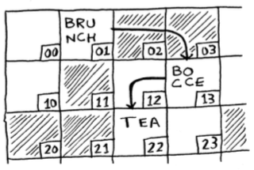
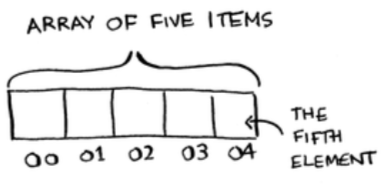
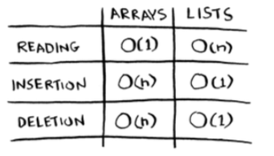
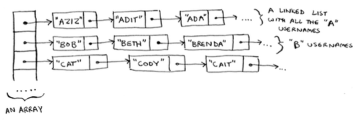

Quick introduction to Linked Lists vs Arrays.  

## Linked Lists  
Linked lists are a common data structure for storing a series of items in memory. Each item stores the address of the next item in the list.  Linked lists are handy because you never have to move your items around in memory. None of the items need to be next to one another. Typically linked lists are better for insertions since there is no initial space requirement of contiguous blocks of memory.  

Below is a snippet taken from Grokking Algorithms[1] to illustrate the point.  
  

## Arrays  
Arrays consist of contiguous blocks of memory. With arrays you know the memory address for every item in the array. The following image utilizes 0 indexing to represent the memory locations in the array.  
  
Arrays are great if you want to read random elements because you can lookup the item instantly with it's index location.  

## Run Time Comparison  
Both of these basic data structures are used often. Arrays allow for random access and are extremely fast, but they require contiguous memory which can hamper their ability to expand. Linked lists can handle operations like insertions and deletions much easier as they only have to update the reference to the next item in memory. Nothing has to be moved.  
  
$O(1)$ refers to a constant run time. Every item has the same run time complexity.  
$O(n)$ refers to a linear run time.  

## Extra  
It's possible for these data structures to be combined. Sometimes an array can contain an linked list at a particular memory location as seen below.  
  

### Reference  
[1] Bhargava, A. Y. (2016). Grokking algorithms: An illustrated guide for programmers and other curious people.
