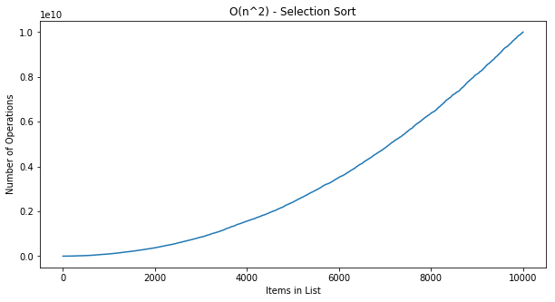

---
layout: post  
mathjax: true  
comments: true  
title: Selection Sort Algorithm
tags: [Algorithm]  
---  

Quick introduction to the Selection Sort Algorithm.  

Selection sort is a simplistic algorithm that can be used to sort an un-ordered list of items. The basic premise of the algorithm is to iterate over a list and select the highest value, then copy it to a new list. The second step is to iterate over the original list (now reduced by one item) to find the next highest item and append it to the second list. This continues until the original list has been completely sorted into the new list.  

This can be implemented fairly easily in python, so we'll start there.  

## Imports


```python
from typing import List

import matplotlib.pyplot as plt
import numpy as np

%load_ext blackcellmagic
```

## Function Definition  
We create a small function to find the smallest number in a list [1] called `find_smallest` that will iterate over an unsorted list and return the smallest value. The second function performs the actual selection sort. `selection_sort` creates a new list by calling the `find_smallest` function on the original list until it has been exhausted.


```python
# Find the smallest number in the list
def find_smallest(l: List[int]) -> int:
    smallest = l[0]
    smallest_idx = 0
    for i in range(1, len(l)):
        if l[i] < smallest:
            smallest = l[i]
            smallest_idx = i
    return smallest_idx

# Repeatedly call find_smallest and append to new list
def selection_sort(l: List[int]) -> List[int]:
    sorted_array = []
    for i in range(len(l)):
        smallest = find_smallest(l)
        sorted_array.append(l.pop(smallest))
    return sorted_array
```

The selection sort algorithm is not very efficient and exhibits a $O(n^2)$ run time. This can be seen in the following graphic.


```python
unsorted_list_10000 = list(np.random.randint(low=1, high=100000, size=10000))
```


```python
fig, ax = plt.subplots(figsize=(10, 5))

ax.plot(np.array(selection_sort(unsorted_list_10000)) ** 2)
ax.set_title("O(n^2) - Selection Sort")
ax.set_ylabel("Number of Operations")
ax.set_xlabel("Items in List")

plt.show()
```





## Summary  
While useful, the selection sort algorithm is slow, and there are more efficient options out there.
