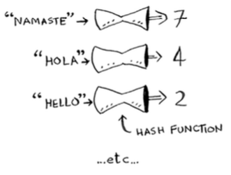
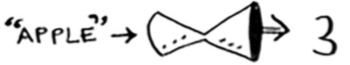
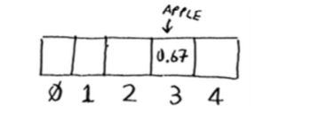

---
layout: post  
mathjax: true  
comments: true  
title: Hash Tables  
tags: [Data Structures]  
---  

Small post about hash tables.  

This post aims to explain a basic data structure, the Hash Table. Before jumping into a hash table, we'll start with what a hash function is. In it's simplest state, a hash function maps strings to numbers. We input some string (i.e. "Hello") into a hash function, and we get a number in return (1). The goal of a hash function is to map the same word to the same number consistently and to map different words to different numbers. Below is a simple graphic from Grokking Algorithms that illustrates the point.  



This becomes useful when we combine it with [arrays](https://jason-adam.github.io/linkedList-arrays/). The hashing function can store the string value that's generated at the index id of an array. Since arrays allow extremely fast random access based on indices, we can retrieve those string values at a later time almost instantly.  Below is another graphic representing this idea.  

  


These two components form our **Hash Table**.  

Pretty much all languages have their own implementation of a hash table, and python is no different. In python the `dict` object is the implementation of a hash table. Hash tables are extremely fast at retrieving data, and in python we can access the values of a dictionary by passing in the key. Below is a basic example.


```python
# Graduate school DS prices $
prices = {
    "NU": 50000,
    "ND": 45000,
    "BK": 60000,
    "GT": 7000,
}
```

We now have a basic dictionary with several *key-value* pairs. We can access any item in the dictionary by simply passing the key like so:


```python
prices["NU"]
```


    50000


## Use Cases  
Hash a large number of use cases. Bhargava [1] lists a few: 
1. Using hash tables as a cache  
2. General lookups (like the example above)  
3. Preventing duplicate entries  

The caching example is one that many internet users often overlook. We've all heard **"have you tried clearing your browser cache?"** before, but how many of us actually understand what that means? Our browser saves the representations of websites we freqent so that next time we access them it will be extremely fast because of the fact that our computer (client) doesn't have to make another server call. A simple graphic below displays this nicely.  


Python has a handy `get` method that you can call on a dictionary to get the value of a **key**. If the key does not exist, a default value of `None` is returned. This is an easy way to check if a value exists, and this is actually how a cache works at a rudimentary level.


```python
if not prices.get("AA"):
    print(None)
else:
    print(prices.get("AA"))
```

    None


## Recap  
* Hash tables are a very fast way to store data.  
* Hash tables are commonly used to filter duplicates.  
* Hash tables are heavily used for caching data instead of making your server perform repeated work.  

### Reference  
[1] Bhargava, A. Y. (2016). Grokking algorithms: An illustrated guide for programmers and other curious people.
