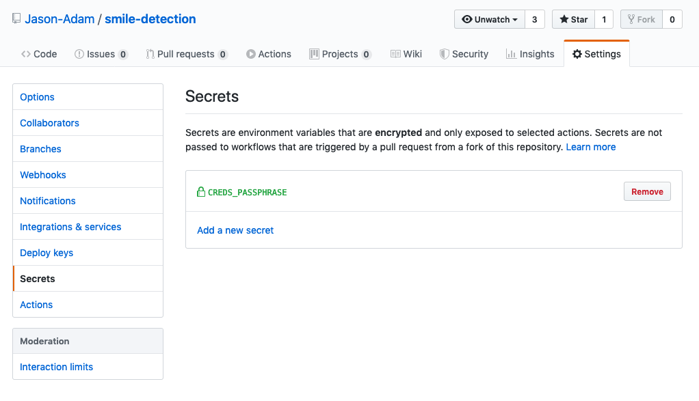

---
layout: post  
mathjax: true  
comments: true  
title: Github Actions
tags: [AWS CI/CD]  
---  

Small post on utilizing Github's new CI tool, Github Actions.  

Github has recently made their CI platform, Github Actions publically available. I came upon it researching CI tools for a school project I was doing where I was building a computer vision model that could be deployed to the [Amazon Deep Lens](https://aws.amazon.com/deeplens/). I needed a way to zip up my AWS Lambda function and re-deploy it when I made changes so that I didn't have to manually do it every time. I looked into setting up Jenkins, but it seemed a little too cumbersome for my use case.  

## Workflows  
Github actions are similar to other tools out there (Gitlab pipelines, Bitbucket pipelines, etc.), and they're extremely easy to setup. The nice thing about them is that you can create an action and reuse it for future projects. The `yaml` file that orchestrates the workflow sits in a folder of your repo titled `.github/workflows/`. Within the file you define **jobs** that you want the pipeline to perform. Here are the first few lines from my AWS Lambda pipeline.  

```yaml  
name: Update Lambda Function  

on:  
    push:
        branches:
            - master
```  

This tells the pipeline to run whenever I push a change to my master branch. After we designate this step, we can start building the actual pipeline.  

AWS requires that you use credentials to login through the command line in the format of a config file that looks like this:  

```bash  
[default]
aws_access_key_id=your_key_id  
aws_secret_access_key=your_secret_access_key
```  

The default piece just designates these as the default credentials for accessing AWS resources. Since we don't want to commit credentials to our repo, I've added the `config` file to the `.gitignore`. We'll write a small shell script that can be executed in our pipeline to access our credentials. First, we encrypt the config file using the following gpg command.  

```bash  
gpg --symmetric --cipher-algo AES256 config
```  

After entering this, you'll be prompted to enter a secret passphrase that will be needed to decrypt the file. Take this passphrase and enter it in the settings of your repo like below.  

  

Once you've entered the passphrase, you need to create a script that will decrypt it in the pipeline. The following shell script will utilize the repo secret to decrypt the `config.gpg` file and make the credentials accessible for future steps.  

```bash  
#!/bin/sh
# Decrypt the creds.json file

# Create directory for secrets
mkdir "$HOME/.aws"

# Decrypt the file using repo variable
gpg --quiet \
    --batch \
    --yes \
    --decrypt \
    --passphrase="$CREDS_PASSPHRASE" \
    --output "$HOME/.aws/config" config.gpg
```  

The AWS cli tools expect the config file to be in the home directory under `.aws/config` so our final step outputs the file there. You can see in the script that we access the pipeline variable **CREDS_PASSPHRASE** that we created in the prior step. Once this step runs, our AWS credentials will be ready to use for interacting with AWS through it's CLI. Before committing the script to your repo, you must make it executable by running the following command.  

```bash  
chmod +x decrypt_secret
```  

The full step for decrypting the secrets looks like this.  

```yaml  
name: Update Lambda Function

on:
  push:
    branches:
      - master

jobs:
  primary:
    runs-on: ubuntu-latest
    steps:
      - uses: actions/checkout@v1
      - name: decrypt config
        run: ./decrypt_secret.sh
        env:
          CREDS_PASSPHRASE: ${{ secrets.CREDS_PASSPHRASE }}
```  

## AWS Lambda  
Now that we've got our AWS credentials securely into our pipeline, let's install the AWS CLI. The following commands can be entered as the next step in the pipeline to pull down the CLI tools.  

```bash  
curl "https://s3.amazonaws.com/aws-cli/awscli-bundle.zip" -o "awscli-bundle.zip"
unzip awscli-bundle.zip
./awscli-bundle/install -b ~/bin/aws
```  

In the pipeline step, we can use the `run: |` command and put each step on a separate line. The `|` symbol indicates that the lines are separate commands. Our next command is to zip up our Lambda function. AWS requires your Lambda code be uploaded as a zip file if it's made up of more than one file (i.e. your function has dependencies). Below is how we zip it up.  

```bash  
cd deeplens-smile-inferer  
zip -r deeplens_smile_inferer.zip .
```  

Our final step consists of publishing this lambda to our AWS account as a new version. We use the `run: >` command to extend a single command line function to multiple lines for easier reading.  

```yaml  
run: >
  aws lambda update-function-code
  --function-name arn:aws:lambda:us-east-1:880540780340:function:deeplens-smile-inferer
  --zip-file fileb://deeplens-smile-inferer/deeplens_smile_inferer.zip
  --publish
```  

And that's it! We've successfully set up a github actions pipeline to publish a new version of our lambda function every time we push a change to our master branch! Here's the full yaml for a complete view.  

```yaml  
name: Update Lambda Function

on:
  push:
    branches:
      - master

jobs:
  primary:
    runs-on: ubuntu-latest
    steps:
      - uses: actions/checkout@v1
      - name: decrypt config
        run: ./decrypt_secret.sh
        env:
          CREDS_PASSPHRASE: ${{ secrets.CREDS_PASSPHRASE }}
      - name: install-cli
        run : |
          curl "https://s3.amazonaws.com/aws-cli/awscli-bundle.zip" -o "awscli-bundle.zip"
          unzip awscli-bundle.zip
          ./awscli-bundle/install -b ~/bin/aws
      - name: zip-lambda
        run: |
          cd deeplens-smile-inferer
          zip -r deeplens_smile_inferer.zip .
      - name: upload-new-lambda
        run: >
          aws lambda update-function-code
          --function-name arn:aws:lambda:us-east-1:880540780340:function:deeplens-smile-inferer
          --zip-file fileb://deeplens-smile-inferer/deeplens_smile_inferer.zip
          --publish
```
