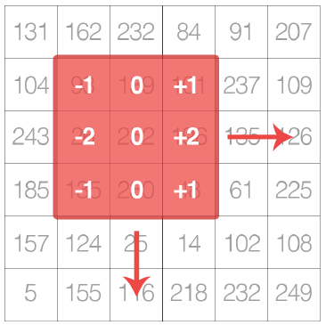
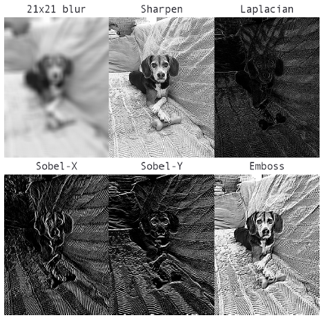
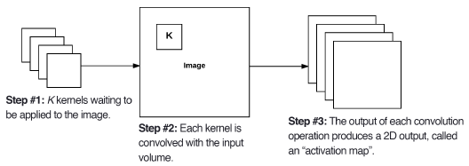
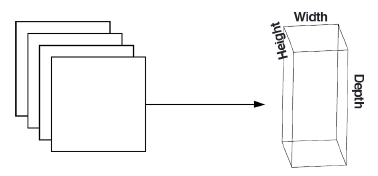
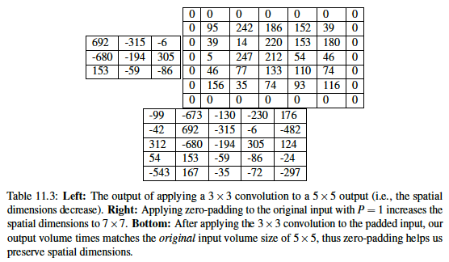
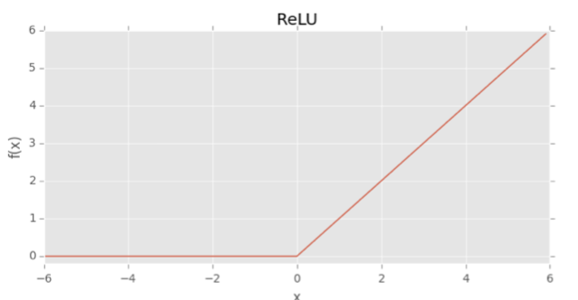
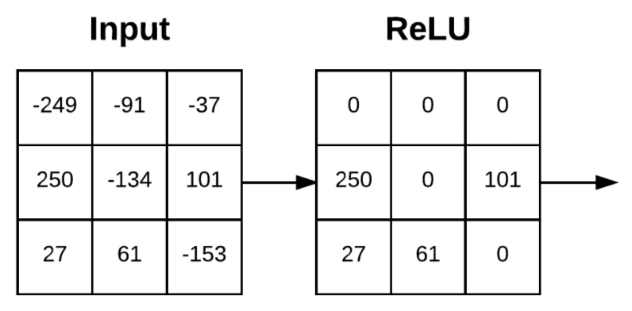
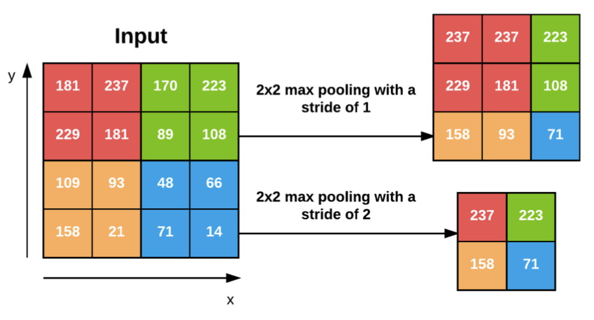
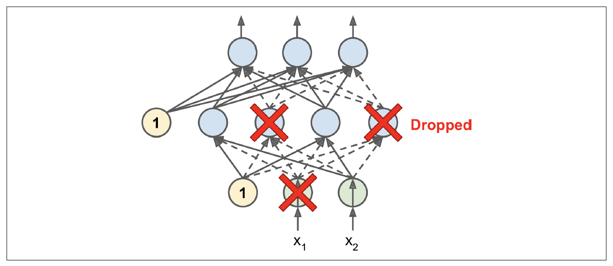
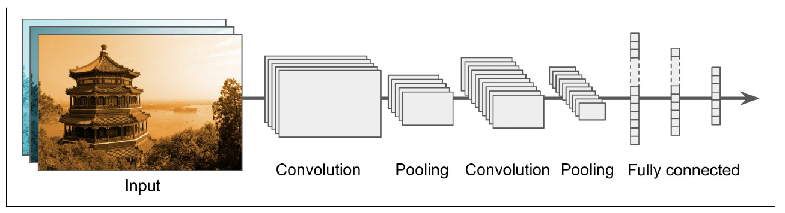

---
layout: post  
mathjax: true  
comments: true  
title: Convolutional Neural Networks  
tags: [Computer Vision]  
---  

What is a Convolutional Neural Network?  

I recently took a Computer Vision class (2019) as one of my electives in my graduate program at Northwestern University, and I found it to be the most beneficial class in the entire program from an applied perspective. The class was a little light on theory, but it more than made up for it with it's focus on utilizing cloud computing and IoT devices to bring inference to the edge. I've done a fair amount of reading in the last few months about Convolutional Neural Networks (CNNs), but I've been looking for a way to start consolidating my knowledge so that I can recall it and reference it later as the need arises.  

The main book that I've been reading (and the one referenced repeatedly in this write-up) is [Deep Learning for Computer Vision with Python](https://www.pyimagesearch.com/deep-learning-computer-vision-python-book/) by [Adrian Rosebrock](https://www.linkedin.com/in/adrian-rosebrock-59b8732a/). Adrian is a leader in the Computer Vision space, and he regularly puts out outstanding content (tutorials, books, etc.) on the topic. The book is very approachable and is packed full of knowledge.  

With that being said, the path through this post will be a condensed version of Chapter 11. Convolutional Neural Networks, for those of you that have the book, and I'll cover:  

* What are Convolutions?  
* What are Kernels?  
* What are the Layer Types in a CNN?  
* Rules of Thumb for Building CNNs  

## What are Convolutions?  
The term "Convolution" is right in the name of the neural network architecture people use for computer vision problems, but it seems some don't necessarily understand what this actually is. An image convolution can loosely be defined as an **element-wise multiplication of two matrices followed by a sum** (Rosebrock, 2017, pp. 171). For those of you that are familiar with any sort of image processing, it will come as no surprise that images are just multidimensional matrices. Color images have a depth of 3 (a layer each for RGB), and Grayscale images have a depth of 1 (all pixels are on the same color scale). In the context of CNNs, there is a smaller matrix called the kernel that slides left-to-right and top-to-bottom across the image matrix and convolves at each location. This leads us to Kernels which are designed to perform various image processing functions. There are many filters (kernels) that have been defined by hand, and we'll get to those next, but the goal of the CNN is to learn these filters automatically. Below is Figure 11.1 (Rosebrock, 2017) from the book, and it does a good job representing the kernel sliding across the image.  

  

## What are Kernels?  
Kernels (or filters) are small square matrices that slide across the image matrix, convolving at each step. What does this really mean? If we reference the image above, we have a small square matrix with pre-specified values that just element-wise multiplication with the image pixel values, then takes the sum. This single sum (i.e. the output value) is stored at the same coordinates as the center of the kernel. The goal of the kernel is to reduce the spatial dimensions of the image and perform some image processing task. Kernels always are an odd sized square matrix so that there is a clear center value (i.e. $3x3$ or $5x5$). Below is a simple example from the book regarding how a kernel slides across the image matrix and performs the convolution. This involves a $3x3$ kernel used for blurring.  

$$
O_{i,j}=\frac{1}{9}* \begin{bmatrix}
1&1&1\\
1&1&1\\
1&1&1\\
\end{bmatrix} * \begin{bmatrix}
93&139&101\\
26&252&196\\
135&230&18\\
\end{bmatrix}
$$  

This results in the following matrix after the element-wise multiplication. We can then take the sum.  

$$
O_{i,j}=\sum \begin{bmatrix}
10.3&15.4&11.2\\
2.8&28.0&21.7\\
15.0&25.5&2.0\\
\end{bmatrix}\approx 132
$$

There are several common kernels that are used for different processing tasks:  

1. Blurring  
2. Sharpen  
3. Laplacian (detect edge-like regions)  
4. Sobel (detect edge-like regions along both x and y axis)  
5. Emboss  

Below is Figure 11.5 from the book that demonstrates the effect these filters have on an image.  

  

Unlike traditional fully-connected standard neural networks, the layers of a CNN are arranged in a 3-dimensional volume (width, height, depth). Depth refers to the channels mentioned above (Grayscale vs RBG) (Rosebrock, 2017, pp. 181). The benefit to this design is that the neurons are only connected to a small region of the layer before it. This is referred to as local connectivity, and it drastically reduces the number of parameters in our network.  

## What are the Layers in a CNN?  
The most common layers used in Convolutional Neural Networks are:  

1. Convolutional  
2. Activation  
3. Pooling  
4. Fully-connected  
5. Batch Normalization  
6. Dropout  

The arrangement of these layers in a specific way results in a CNN.  

### Convolutional Layers  
Convolutional layers consist of $K$ learnable filters (i.e. kernels). These filters are responsible for creating activation maps as they slide across the image matrix. Below is Figure 11.6 from the book, and it displays this concept. Each kernel is convolved with the input and generates a 2D output called the activation map.  

  

After all $K$ filters have been applied to the input, we then stack the activation maps along the depth dimension of our array to form the final output (image below: Figure 11.7).  

  

Every entry in the output volume is an output of a neuron that looks at only a small region of the input (Rosebrock, 2017, pp. 182). The network learns filters (kernels) that activate when they see a specific type of feature at a given spatial location. This makes sense if we think back to what a kernel does. This could mean that we've detected an edge or perhaps corner-like regions. This concept relates back to the idea of local connectivity whereby a small filter convolves with a larger input volume. This local region of the input volume that our neuron is connecting to is known as the receptive field (or variable $F$). This can be better illustrated by the example on page 183 (Rosebrock, 2017). Imagine we have an input size of $32x32x3$. If our receptive field is $3x3$, then each neuron in the convolutional layer will connect to a $3x3$ local region of the image resulting in $3x3x3=27$ weights.  

There are three separate parameters that control the size of an output volume:  

1. Depth  
2. Stride  
3. Zero-Padding  

#### Depth  
Depth is simply the number of filters we are learning in the current layer.  

#### Stride  
Stride refers to the number of pixels we slide the kernel over the input volume. The typical number is 1 or 2 ($S=1$ or $S=2$). A stride of 1 results in overlapping receptive fields as the same pixels are convolved multiple times. These also result in larger output volumes. When $S=2$, we skip two pixels at a time resulting in a smaller output volume and non-overlapping receptive fields. Changing the stride of the kernel is a way to reduce the spatial dimensions of the input volumes. Along with pooling, this is the main way to perform this reduction.  

### Zero-Padding  
Padding the borders of an input volume can/will result in the output volume maintaining the original image size. The most common way of performing this is padding the outside of the matrix with zeros (hence the name). The parameter used for this padding is $P$. Padding becomes very important when we start examining deep CNN architectures where multiple convolutional filters are stacked on top of each other (Rosebrock, 2017, pp. 184). Below is a good example of what this process actually looks like. We are convolving a Laplacian kernel with an input image, but we pad the outside with zeros first so that the resulting output volume matches the original input volume (allows us to preserve spatial dimensions).  

  

If we examine all the variables thus far (F, S, P), we can compute the size of an output volume as a function of the input volume size. In order for us to construct a valid convolutional layer, we need to ensure that the result of the following equation is an integer.  

$$  
(\frac{(W-F+2P)}{S})+1
$$  

$$
F=receptive\ field\ size\\
S=stride\\
P=zero\ padding
$$  

If this equation does not result in an integer, it means tha tthe strides are set incorrectly, and the neurons cannot be slide across the input volume in a symmetric way (Rosebrock, 2017, pp. 184).  

### Activation Layers  
After every convolutional layer we apply a nonlinear activation function. The most commonly used functions are ReLU, ELU, and Leaky ReLU. No "learning" is done within an activation layer. The activation function is applied element-wise so that the output layer is always the same as the input dimension.  

#### ReLU  
ReLU stands for Rectified Linear Unit, and the function is as follows:  

$$  
f(x)=max(0,x)
$$  

The function is zero for negative inputs but linearly increases for positive values (Rosebrock, 2017, pp. 126). Below is a graphical representation of the function.  

  

Activations are performed in-place so there is no need to create a separate output volume. Below is Figure 11.9 from the book that represents applying the above function to an input.  

  

ReLU tends to outperform other common activation functions (sigmoid and tanh). Explaining Neural Network basics is outside the scope of this post, but it will be covered in a future write with a more in-depth explanation of activation functions.  

### Pooling Layers  
Pooling layers are typically used to progressively reduce the spatial size of the input volume. This is done to help reduce the overall parameters of the network and to control overfitting. Max pooling also slides across a volume, and the typical size is a $2x2$ square matrix with a stride of 1. The max value from each stride is taken. A stride of 1 results in overlapping pooling, and a stride of 2 (assuming $2x2$ window) results in non-overlapping pooling. Below is an example from the book regarding max pooling and how it reduces the spatial dimensions.  

  

### Fully-Connected Layers  
The end of our network typically has 1-2 fully-connected (dense) layers. Each node is connected to all activations in the previous layer. This is normally employed prior to a final classifier that will output class probabilities.  

### Batch Normalization  
Batch normalization does exactly what the name implies... it normalizes the activations of a given input volume before passing it to the next layer in the network. This is done during training of the network. Batch normalization can greatly reduce the number of epochs required and help stabilize training (learning rate and regularization are less volatile). It also tends to yield lower final loss and a more stable loss curve. The biggest drawback to using batch normalization is that it can greatly extend the actual time it takes to train the network due to the increase in additional computations. The most common place to utilize batch normalization is after the activation function. Intuitively, this makes sense as the ReLU activation function is designed to kill off activations that are less than 0. Normalization implies that we zero-center our activations, and this could result in activations being discarded by the ReLU function that weren't originally less than zero.  

Below is how we calculate the normalization during training.  

$$  
x=mini-batch\ of\ activations\\
\hat{x}=normalized
$$  

$$
\hat{x_{i}}=\frac{x_{i}-\mu_{\beta}}{\sqrt{\sigma_{\beta}^2+\epsilon}}
$$  

$$
\mu_{\beta}=\frac{1}{M}\sum_{i=1}^m x_{i}
$$  

$$
\sigma_{\beta}^2 = \frac{1}{m} \sum_{i=1}^m (x_{i} - \mu_{\beta} )^2
$$  

At testing time we replace the mini-batch $\mu_{\beta}$ and $\sigma_{\beta}$ with their respective running averages computed during the training process. This ensures that the network can still make predictions on images without being biased by the last values calculated in the final mini-batch (Rosebrock, 2017, pp. 189).  

### Dropout  
Dropout is a very popular regularization technique that is commonly used to reduce overfitting. It was proposed by Geoffrey Hinton in 2012 (Geron, 2019). Dropout proves to be quite simple, yet it typically provides a significant accuracy boost. The variable $p$ represents the dropout rate. The dropout rate refers to randomly disconnecting inputs from the preceeding layer to the next layer in the network. Why does this work? Neurons are not allowed to co-adapt with their neighboring neurons. This means that each neuron needs to be able to stand on its own, and it also ensures that we have multiple redundant nodes that will activate when presented with similar inputs. Why is this important? It allows our network to generalize better! The dropout probability is normally set to $50\%$ and occurs between the fully-connected layers (Rosebrock, 2017, pp. 191). Below is a figure from the Geron book that shows the concept nicely.  

  

## Pulling It All Together  
Below is a figure 14-11 from Geron's book that captures the basic architecture of a CNN nicely.  

  

Below is a list of some **rules of thumb** that you can follow according to Rosebrock (2017).  

1. Inputs to the network must be square so that highly optimzed linear algebra functions can be utilized.  
2. The input layer should be divisible by two multiple times after the first convolutional layer is applied. This allows for efficient downsampling with the pooling layer.  
3. Convolutional layers should use smaller filters. $3x3$ and $5x5$ are common. Larger filters can be used on the first convolutional layer if the input size is greater than $200x200$.  
4. The stride should typically be set to 1 for convolutional layers.  
5. You should apply zero-padding.  
6. Apply pooling layers to reduce the spatial dimensions. The common size is a $2x2$ receptive field with a stride equal to 2.  
7. Use batch-normalization (after activation layer).  
8. Use dropout between fully-connected layers (typical value is $p=50\%$).  

I hope you enjoyed this write-up and that it might help clarify what a CNN actually is and how it works.

## References  
[1] Geron, A. (2019). Hands-On Machine Learning with Scikit-Learn, Keras, and TensorFlow: Concepts, Tools, and Techniques to Build Intelligent Systems. OReilly Media, Incorporated.  
[2] Rosebrock, A. (2017). Deep Learning for Computer Vision with Python (1.1.0 ed.).  
