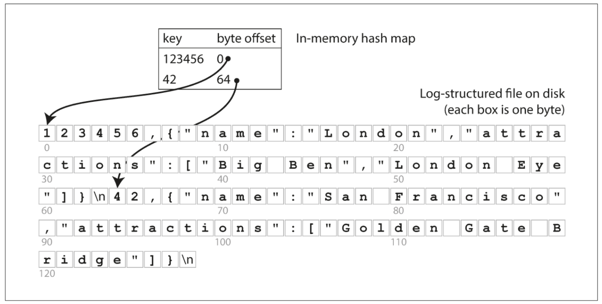
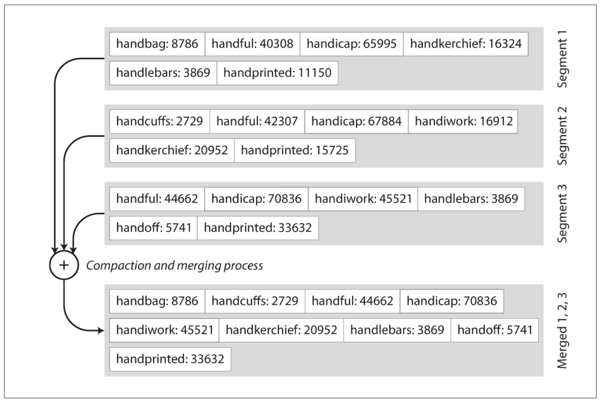
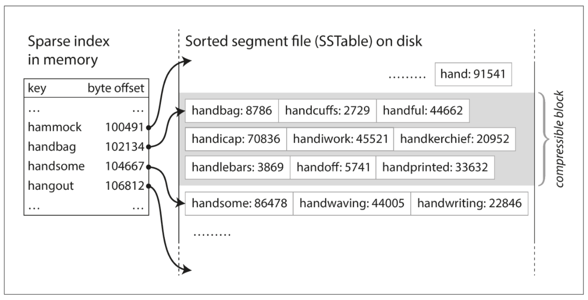

---
layout: post  
mathjax: true  
comments: true  
title: Data Structures of Databases  
tags: [Data Structures]  
---  
What are the data structures that power our databases?  

I've admittedly become minorly obsessed with studying data structures and algorithms lately, and I've decided to pair that study with my second read through of Martin Kleppmann's book, *Designing Data-Intensive Applications* [1]. The book is chalk full of great material as it relates to databases, application design, and distributed systems. Anyways, the reason I decided to pair these two courses of study is due to the fact that I see a large volume of folks online that study algorithms and data structures through the singular focus of a site like LeetCode, and I've always felt like the concepts don't stick unless you see them in action. A good example of this relates to how different databases work. In an algorithms book one will most likely encounter trees at some point. Binary Trees, Binary Search Trees (BSTs), etc will be taught, their Big O time space complexity for traversal will be memorized, and all will be right in the world. However, many people write SQL queries every day and don't understand how they can retrieve data so quickly due to it's declarative nature. This leads me to the point of this post. I aim to simplify and condense some of Kleppmann's work in his book to perhaps shed some light on how powerful these data structures are and how they are the backbone of data retrieval for most modern day databases.  

I'll focus on the 3 main indexes described in the book:  
* Hash Indexes  
* LSM-Trees  
* B-Trees  

## Hash Indexes  
Most of us are familiar with the swiss army knife of data structures, the [hash map](https://jason-adam.github.io/hash-tables/). It boasts O(1) lookup time which makes it an excellent choice for things like simple caching, de-duplicating records, and just about anything else we want. Kleppmann describes a simple example in the book whereby we keep an in-memory hash map where the key is mapped to a byte offset in the data file [1]. This translates to the location in which a record is found. We can leverage the lightning fast lookup time to quickly retrieve a record from our file, and voila, we're done. This setup is essentially how [BitCask](https://github.com/basho/bitcask) works (the default storage engine for the NoSQL database [Riak](https://riak.com/index.html)). Below is an illustration of this concept from Kleppmann's book (fig 3-1).  

  

The main limitation of the hash index is its need to be in memory. If you have a small number of keys, and you don't require any sort of range queries, then they can be a very viable choice. Range queries are inefficient due to needing to retrieve each individual key within the range.

## SSTables & LSM-Trees  
Apart from the hash map, I find graphs and trees (just a type of graph) to be some of the coolest data structures. I think most people can intuit how to traverse an array or linked list due to linear visual they evoke, but they fall short in usefullness when we start talking about indexing a database (all the cool kids study graphs).  

In the first example I purposely left out the data being indexed. It was an append only log file (zzzzzz.... boring), but I'll state it briefly to set the stage for the next portion. SSTable stands for *Sorted String Table*. This differs from an append only log file by requiring the sequence of key-value pairs to sorted (woah, mind blowing!). They have several advantages over log segments with hash indexes, and I'll do my best to condense down the material into a human readable format [1]:  

* Merging segments is simple and efficient (think mergesort -> I smell a future post coming). Below is the visual from the book whereby we see several segments compacted and merged (fig 3-3).  

  

* You no longer need to keep all keys in memory! This is due to the sorted nature. We can now keep some of the keys in our in-memory hash map with their offsets and find records near them by retrieving their offset, then scanning until we find what we need. This is displayed below (fig 3-5).  

  

* Since read requests need to scan several key-value pairs in a range, those records can be grouped and compressed before writing to disk [1]. This concept is displayed above in the grayed out compressible block section (along the right).  

### Building & Maintaining SSTables  
Now that we have basic understanding of what a sorted string table is, we can devise a storage engine with the following steps (or algorithm if you're feeling fancy) [1].  

* When we receive a new write, add it to an in-memory self-balancing tree (Red-Black Tree, AVL Tree -> No shortage of future post material). This tree is sometimes referred to as a *memtable* [1].  
* When the memtable reaches a threshold, write it to disk as an SSTable (the tree maintains a sorted order). This newest file becomes the most recent database segment while a new memtable instance begins receiving writes.  
* Serving requests order: memtable lookup -> most recent on-disk segment -> older segments -> etc.  
* Periodically run compaction as a background process to combine segment files and discard overwritten / deleted values [1].  

As an interesting (albeit nerdy) aside, the terms **memtable** and **SSTable** were introduced in Google's Bigtable paper (I've lost count of future post ideas). This type of indexing structure is known as a *Log-Structured Merge-Tree*. Storage engines that utilize this strategy are known as LSM engines. Kleppmann goes on to discuss optimization of performance, but it's a bit outside what I was looking to cover in this post.  

## B-Trees  
The final data structure I want to touch on is the **B-Tree**. I wrote SQL all day, every day, for about 5 years (also known as SQL hell), and I only maintained a cursory knowledge of proper database indexing strategies. I knew how to create indexes, clustered, non-clustered, etc, but I never really understood how they worked under the hood due to the declarative nature of working with a relational database. After reading Kleppmann's book, I have a newfound appreciation for the elegance of their implementation. It's even more impressive when you realize they've been around since the 1970s!  

Similar to SSTables, B-Trees keep key-value pairs sorted by key for fast, efficient lookups, but beyond that they differ greatly. B-Trees break the database down into blocks or pages, reading and writing only one page at a time [1]. Each page is identified using an address, allowing pages to refer to one another. For those of you who have studied [Linked Lists](https://jason-adam.github.io/linkedList-arrays/), you'll recognize the pattern of pages pointing each other, but with a B-Tree it's on-disk vs in-memory. This concept is illustrated below (fig 3-6).  

  

As displayed in the image, the root node in the tree contains references to child pages. Not all keys are present, but rather keys within a range. If a value is not found in the node (page), then we can locate the numer above and below it, use the reference to the child page to move down closer to our value. This process continues until we find our actual value. Each child node has a subset of ranges that allow us to drive down to a terminal node, more commonly known as a leaf node (these are trees afterall).  

One important thing to note about B-Trees is their *branching factor*. This refers to the number of references to child pages in one page of the tree. Our example above has a branching factor of 6, but in B-Trees in the wild contain branching factors upwards of several hundred. Updating values requires a traversal of the tree until you find the leaf page, update the value, write the page back to disk. Adding keys requires finding the page where the value would go and adding it (if space permits) or splitting the page into 2 (if space does not permit). The parent page is then updated to account for the two newly formed child pages. This balancing algorithm ensures that B-Trees always maintain a depth of $O(log(n))$ where $n$ is the number of keys.  

## Comparison of B-Trees and LSM-Trees  
So why on earth do we care about these things? Why can't we just write some crappy SQL queries and do stuff in python like all the cool kids? Well, I love learning how things work, and database indexing is a real-world use case for understanding complex data structures. Sometimes you just have to nerd out for the sake of nerding out. That being said, Kleppmann describes some ups and downs of these two powerful indexing strategies.  

A B-Tree index writes data twice, once to the write-ahead-log (*wal*) and once to the page. Log-structured indexes also write multiple times due to repeated compaction and merging of SSTables [1]. This idea of one write to the database resulting in multiple writes to disk is known as **write amplification**. This can become a serious performance issue in write heavy applications. LSM-Trees are compressed better (smaller is better in the age of big data - oxymoron). There are some other nuanced comparisons, but I think these are the main ones for consideration.  

## Recap  
If you find yourself having made it this far in a post written about database indexing data structures, written by a data nerd, then I applaud you. I encourage everyone to learn some fundamentals about the tools they use on a daily basis and how they work. This advice is amplified for those that study data structures and algorithms just for the sake of studying them. If you never understand why someone came up with them or how they're used, the learning turns into rote memorization instead of understanding and appreciation.  

Happy Learning!

Cheers,  
Jason

### Reference  
[1] Kleppmann, Martin. Designing Data-Intensive Applications: The Big Ideas Behind Reliable, Scalable, and Maintainable Systems. 1st ed., O’Reilly Media, 2017.
