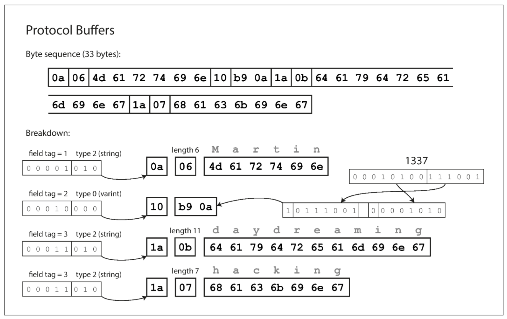

---
layout: post  
mathjax: true  
comments: true  
title: Protocol Buffers  
tags: [Software Development]  
---  
Why can't we just use JSON?  

Nowadays we have access to nearly unlimited computing power (as long as the check clears). Platforms like GCP, AWS, Azure, etc allow us to scale systems with relative ease. Even though we have this capability at our fingertips, I still find myself drifting towards the optimization mindset. I know that **premature optimization is the root of all evil**, but I feel like you have to strike a balance. Refusing to acknowledge it can backfire tremendously, but over indulgence can lead to delays and trivial gains. This is all a slightly roundabout segway to the point of this post. Protocol buffer(s) is a binary encoding library that can be used for efficiently transfering data between services. I'll unpack that a little bit in the following sections and compare it to the industry standard for moving stuff around (i.e. JSON -> we all know it and love it).

## What is a Protocol Buffer?  
If you've written any code that calls an API that returns some payload, chances are you've manipulated JSON in some way, shape, or form. This post will not be about how to send a JSON payload or even how to use Protocol buffers, but rather a comparison of the two in the hopes that more developers might see that it's ok to think about optimization (I know, it's scary!).  

I've been enjoying a second read through of Martin Kleppmann's book *Designing Data-Intensive Applications* [1], especially areas that focus on elegant optimization techniques (this shouldn't shock you at this point). He uses a contrived example of a JSON payload seen below:  

```json  
{
    "username": "Martin",
    "favoriteNumber": 1337,
    "interests": ["daydreaming", "hacking"]
}
```  

The textual encoding of this JSON payload takes up **81** bytes (what are those?). If you don't know what bytes are at this point in your developer journey, I suggest you Google them and learn a bit about memory before circling back (TLDR -> sending less bytes across the wire is better). If you don't know how to Google the word "bytes", then how did you find this lowly blog?  

As I mentioned above, Protocol Buffer(s) is a binary encoding technique that allows us to transfer data around in much smaller payloads. I'm using the word payloads loosely here as we can use these types of data formats for regular data exchange that's not through some sort of API, REST or otherwise. Now, what are binary encodings? Binary is a term that would have frightenend me a couple years ago (ok, maybe it still does), but the idea behind Protocol buffers is really quite elegant. They were originally developed at Google and open sourced over 10 years ago. Below (fig 4-4) [1] is the representation of the same JSON payload with the Protocol buffer encoding applied. We'll walk through what makes this much more efficient. It packs the same information into only 33 bytes (almost 1/3 rd the size!).  

  

We can see the full byte sequence at the top of the image (again only 33 bytes vs 81!). This is acheived by packing a field type and tag number into a single byte. The tag number represents the **field names** (i.e. "username"). This is a much more compact way to represent them. The schema that is generated in code maps these numbers to their textual representation rather than sending the full text (think of a long key name -> looking at you Java devs). The type is encoded based on whether it is an integer, string, list, etc, and string values are encoded using their UTF-8 values.  

There are other formats mentioned in the book (Thrift, Avro, etc), but they all essentially aim to do the same thing (make things smaller), so I won't cover them here. The reason I chose Protocol Buffers is that Google also uses a technology called gRPC which forms a synergy in terms of data transfer.  

## How does gRPC tie in with Protocol Buffers?  
This section will not be about how to use `protoc` or which languages can have schemas generated for them (it's quite a few), but rather the concept behind using something like gRPC for data transfer. It makes sense to use a standard REST interface for an externally facing API or even an internal one, but if you absolutely need speed and efficiency, then you should consider gRPC. I may devote a future post to remote procedure calls, but it's not what I'm aiming for here.  

According to the documentation, it's "a modern open source high performance RPC framework that can run in any environment" [2]. There are several usage scenarios listed, but the one I see most consistently (based on my neophyte knowledge of the industry) is as a way to efficiently connect services in a microservice architecture. If you haven't guessed it by now, gRPC uses Protocol buffers as its interface. This combination allows for lightening fast transfer of data (smaller, remember) within well-definted schemas. The layperson translation is that we are sending smaller things quickly. In a world where everyone is vying for our attention, speed matters.  

If you're interested in learning more about how to use gPPC, you can find plenty of examples in their documentation.  

## Recap  
I hope this brief write-up around a technology (along with it's implementation) will urge you to invest in some optimization. You may find that you can achieve impressive gains with little effort thanks to technologies freely given to us. I think it's important to have a passing understanding of the technology we use. The internet is littered with trivial code snippet blogs (I've pumped out a few myself) that don't go beyond a toy example, and I'm trying to take it one step further to explain technologies and concepts the best I can. I find it the best way to solidify my learning and hopefully help one or two people in the process (my google analytics game is weak).

Cheers,
Jason

### Reference  
[1] Kleppmann, Martin. Designing Data-Intensive Applications: The Big Ideas Behind Reliable, Scalable, and Maintainable Systems. 1st ed., O’Reilly Media, 2017.  
[2] https://grpc.io/about/

